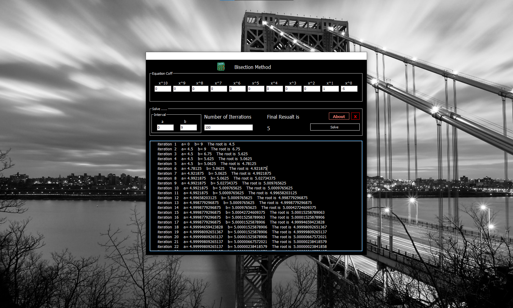

# Bisection_Method
مشروع السنة الأولى المعمارية مادة الرياضيات برنامج لحل المعادلات عدديا بطريقة التقسيم 
Bisection Method
يمكنك تعديل البرنامج واستخدامه بدون قيود

## مميزات التطبيق

- حل المعادلات الرياضية حتى الدرجة العاشرة

## صور من التطبيق

  

